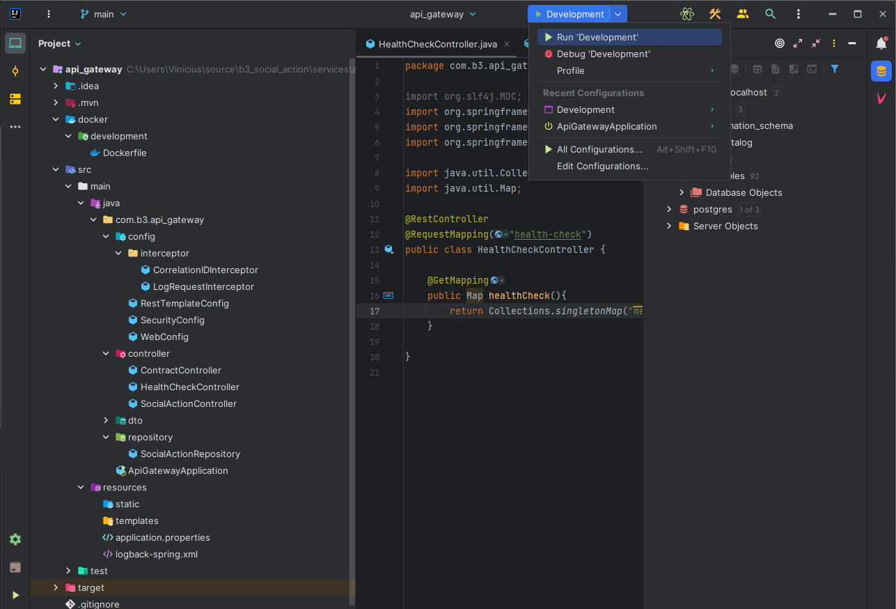

# Descrição do Projeto

 O sistema visa otimizar o processo de divulgação, gerenciamento e estabelecimento de ações sociais entre a administração da B3 Social e seus colaboradores. Atualmente, a falta de um sistema adequado dificulta o acompanhamento e eficácia dessas atividades. Este sistema tem como objetivo principal proporcionar uma plataforma centralizada para cadastrar, divulgar e monitorar ações sociais, bem como facilitar o estabelecimento e gestão de contratos de ação social.

# Objetivos do Sistema

O sistema de Gestão de Ações Sociais da B3 Social tem os seguintes objetivos:

- Facilitar o cadastro de ações sociais pela administração da B3 Social.
- Possibilitar a divulgação eficiente das ações sociais aos colaboradores.
- Permitir que os colaboradores manifestem interesse em participar das ações sociais.
- Automatizar o processo de estabelecimento de contratos de ação social entre a B3 Social e seus colaboradores.
- Fornecer um meio de acompanhamento contínuo das ações sociais em andamento.
- Contribuir para o alcance dos objetivos estabelecidos pela B3 Social.


# Setup

##  Pré-requisitos Linux/Windows
 
 Garantir que os seguintes progamas estejam instalados na maquina, em ambiente windows recomenda-se o uso do [wsl 2](https://learn.microsoft.com/en-us/windows/wsl/install)

 - Make
 - docker
 - docker-compose
 - intelij

 ## Estrutura do repositório

 - Os microserviços estão dentro da pasta `services`

 - a pasta `database` está a configuração da imagem docker do postgres
    
    - na pasta `keycloak`, está o dump do banco de dados do keycloak, onde está toda configuração de client,roles,usuarios e etc...

## Serviços Auxiliares

- [Keycloak](https://www.keycloak.org/)
    - portas: 8084
- [Rabbitmq](https://www.rabbitmq.com/)
    - portas: 5672, 15672
- [Postgres](https://www.postgresql.org/)
    - portas: 5432


#  Uso em ambiente de desenvolvimento

Após entrar na pasta de algum dos serviços   rodar o comando init:

 ```sh
    make init
 ```

Após o comando rodar pode-se verificar se os serviços auxiliares estão funcionais rodando o comando:

 ```sh
    docker ps 
 ```
Após entrar no intelij, verá que existe uma configuração chamada development, como na imagem abaixo.



Quando rodar essa configuração toda vez que o projeto for construido(build), será atualizado em tempo real a aplicação dentro do container

| Serviço | Porta | Tipo |
| ---| ---|---|
| api gateway | 32256 | microserviço |
| social action| 32520 | microserviço |
| contract | 32521 | microserviço |
| invoice | 8086 | microserviço |
| keycloak | 8084 | auxiliar |
| postgres | 5432 | auxiliar |
| rabbitmq | 15672 | auxiliar |
| rabbitmq | 5672 | auxiliar |


## Migrations

 As migrations estão sendo utilizadas com a biblioteca flyway, quando entrar dentro de algum service, rodar o seguinte comando

```sh
./mvnw -D flyway.configFiles=./src/main/resources/application.properties flyway:migrate
```


 


